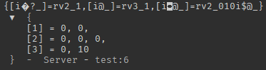

# roblox_pack.luau
### a library for converting Roblox data types to and from text

### NOTE: Instances are converted to and from paths.
# Usage:
### Call `pack` to convert data into a string. `pack` expects a table, so wrap your value(s) around a table if necessary.
```lua
roblox_pack.pack(data: {any}) -> string
```
### Call `unpack` to convert a packed string back into the original table passed.
```lua
roblox_pack.unpack(packed: string) -> {any}
```

# Example:
```lua
local roblox_pack = require(game.ReplicatedStorage:WaitForChild("roblox_pack"))
local data = {Vector2.zero, Vector3.zero, Vector2.new(0, 10)}
local packed = roblox_pack.pack(data)
print(packed)
local unpacked = roblox_pack.unpack(packed)
print(unpacked)
```
### Output:


# Supported data types:
#### Luau:
- [x] nil
- [x] boolean
- [x] number
- [x] string
- [x] table

#### Roblox specific:
- [x] Axes
- [x] BrickColor
- [x] CatalogSearchParams
- [x] CFrame
- [x] Color3
- [x] ColorSequence
- [x] ColorSequenceKeypoint
- [x] DateTime
- [ ] DockWidgetPluginGuiInfo - properties are read only
- [x] Enum
- [x] EnumItem
- [x] Faces
- [x] FloatCurveKey
- [x] Font
- [x] Instance - NOTE: Instances get converted to and from paths
- [x] NumberRange
- [x] NumberSequence
- [x] NumberSequenceKeypoint
- [x] OverlapParams
- [ ] Path2DControlPoint - TODO
- [x] PathWaypoint
- [x] PhysicalProperties
- [ ] Random - no way to transfer internal state besides seed
- [x] Ray
- [x] RaycastParams
- [ ] RaycastResult - not constructable
- [ ] RBXScriptConnection - not constructable
- [ ] RBXScriptSignal - not constructable
- [x] Rect
- [ ] Region3 - TODO
- [ ] Region3int16 - TODO
- [ ] RotationCurveKey - TODO
- [ ] Secret - Not applicable 
- [ ] SharedTable - TODO
- [x] TweenInfo
- [x] UDim
- [x] UDim2
- [x] Vector2
- [x] Vector2int16
- [x] Vector3
- [x] Vector3int16
